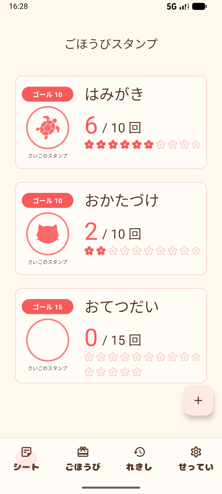
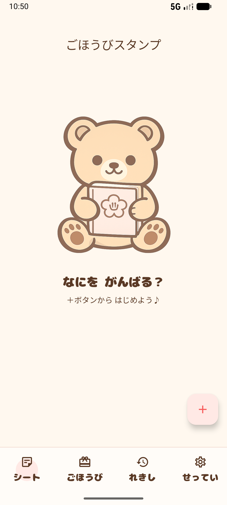
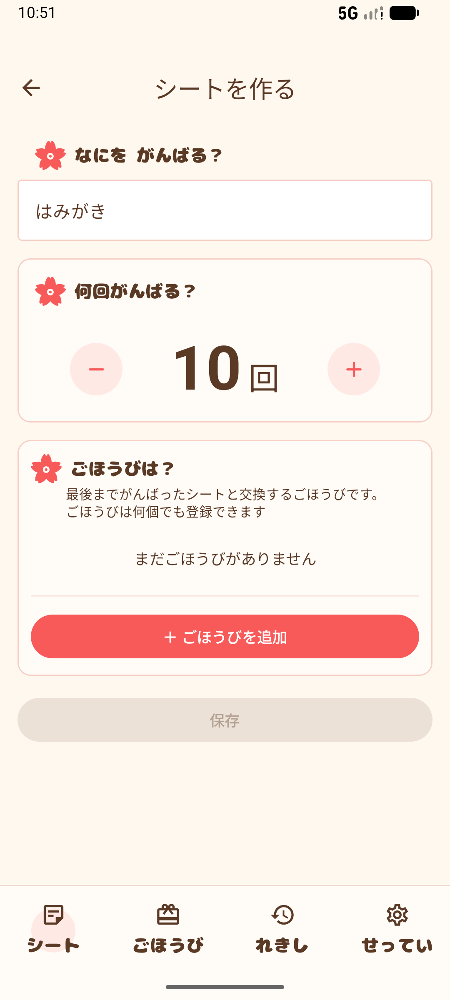
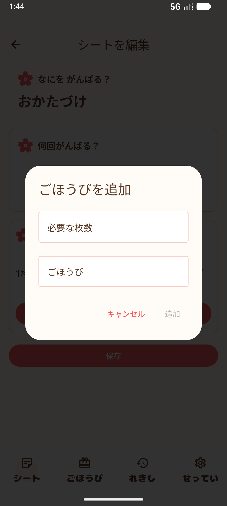
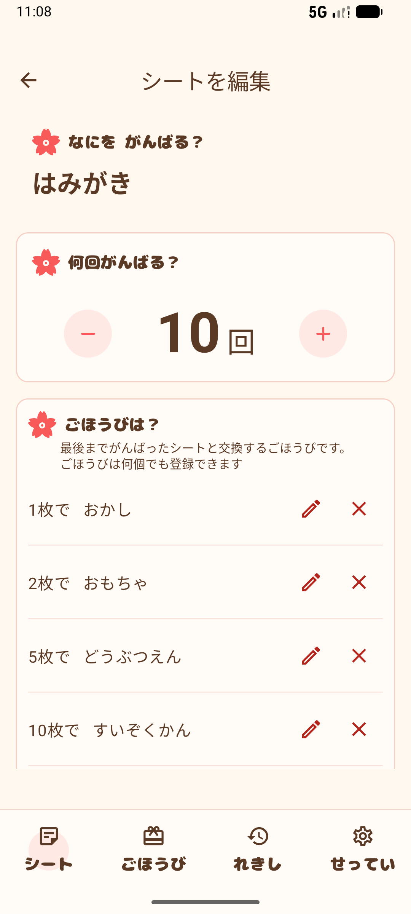
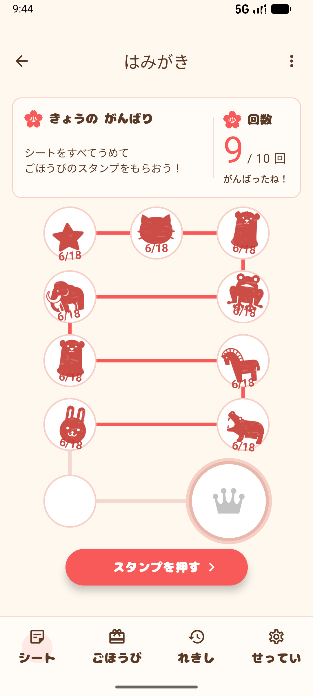
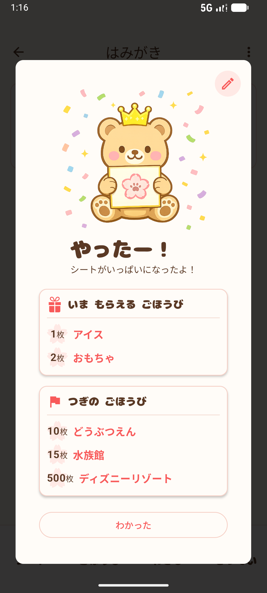
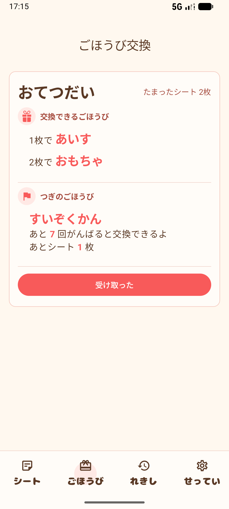
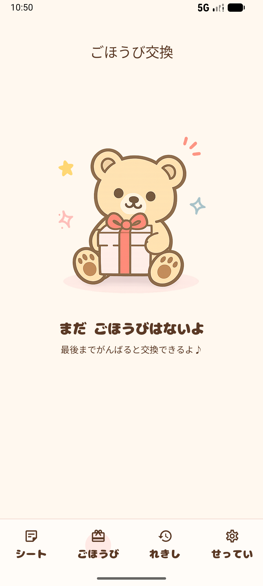
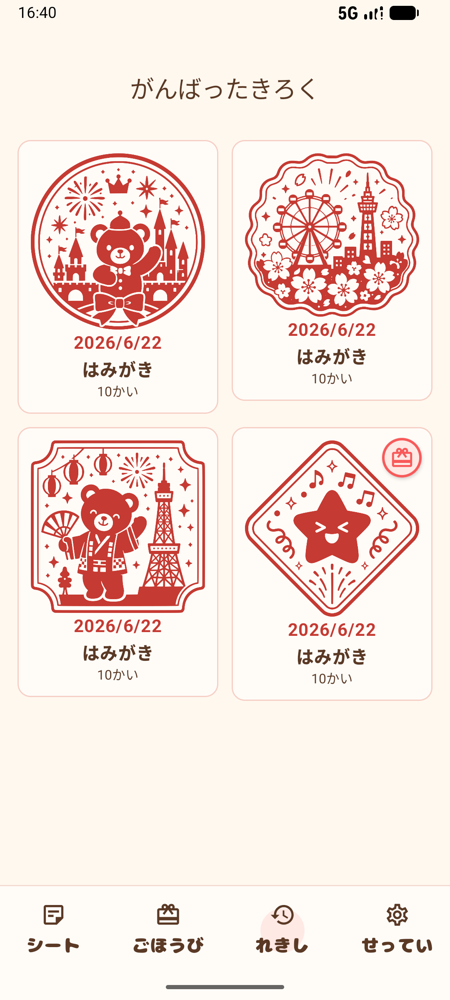

# ごほうびシール

子どもの「がんばった！」を記録する、ごほうびシールアプリです。

紙のごほうびシートをスマートフォンの中で管理できます。

## 概要

「はみがき」「おかたづけ」「おてつだい」など、子どもが頑張る目標を登録します。

目標を達成すると、ごほうびを受け取るための記録が作成されます。

親子で達成感を共有しながら、楽しく習慣づくりをサポートします。

## スクリーンショット

### シート一覧

<p align="center">
  
  
</p>

### シート登録

<p align="center">
  
  
</p>

### シート編集

<p align="center">
  
</p>

### シート詳細

<p align="center">
  
  
</p>

### ごほうび交換

<p align="center">
  
  
  
  
</p>

### 履歴一覧

<p align="center">
  
  
</p>

## Getting Started

リポジトリをクローンしたら、一度 Gradle を実行して開発環境を初期化してください。

```bash
git clone git@github.com:cheesecomer/RewardSeal.git
cd RewardSeal

./gradlew help
```

Git Hooks が設定されている場合、以下のチェックが自動で実行されます。

- **pre-commit**
  - `./gradlew ktlintCheck`
  - `./gradlew detekt`

- **pre-push**
  - `./gradlew assembleDebug`

## 主な機能

### シート管理

- ごほうびシートの作成
- ごほうびシートの編集
- ごほうびシートの削除
- ごほうびシート一覧表示
- ごほうびシート詳細表示

### がんばり記録

- スタンプ追加
- 進捗表示（現在回数 / 目標回数）
- ごほうび達成判定
- ごほうび達成画面
- 同じ内容で再スタート
- 内容を変更して再スタート

### ごほうび管理

- 未受領ごほうび一覧
- ごほうび受領記録
- 未受領ごほうび件数表示

### がんばり履歴

- 完了済みシート一覧
- 完了済みシート詳細
- 過去の達成記録の閲覧

### ホーム画面

- 進行中シート一覧
- 未受領ごほうびへの導線
- 完了済みシートへの導線
- 空状態表示
- シート作成 FAB

## 技術スタック

- Kotlin
- Jetpack Compose
- Navigation Compose
- Room
- ViewModel
- Kotlin Coroutines
- MVVM
- Repository Pattern

## アーキテクチャ

```text
UI (Compose)
↓
ViewModel
↓
Repository
↓
Room (DAO)
↓
SQLite
```

## データモデル

### RewardSheet

現在進行中のごほうびシート

- タイトル
- ごほうび
- 現在回数
- 目標回数

### CompletedRewardSheet

達成済みのごほうび履歴

- シートID
- タイトル
- ごほうび
- 目標回数
- 達成日時
- ごほうび受領済みフラグ

## 今後の予定

- 双六風のシート表示
- スタンプ押下日時の記録
- 統計画面
- アニメーション演出
- イラスト・アイコン整備
- Google Play 公開

## Code Quality

コードスタイルと静的解析には ktlint と Detekt を使用しています。

### Format

```bash
./gradlew ktlintFormat
```

### Check

```bash
./gradlew ktlintCheck
./gradlew detekt
./gradlew assembleDebug
./gradlew testDebugUnitTest
./gradlew koverHtmlReportDebug
./gradlew koverVerifyDebug
```
