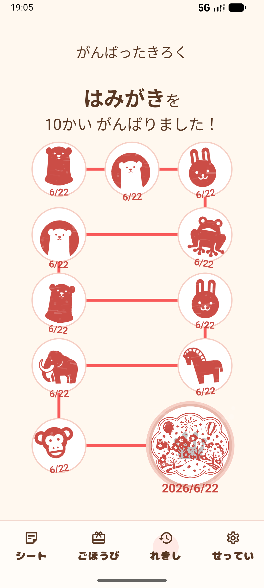

# ごほうびスタンプ

子どもの「がんばった！」を記録する、ごほうびスタンプアプリです。

## 概要

「はみがき」「おかたづけ」「おてつだい」など、子どもが頑張る目標を登録します。

目標を達成すると、ごほうびを受け取るための記録が作成されます。

親子で達成感を共有しながら、楽しく習慣づくりをサポートします。

## Why I built this

紙のごほうびシートは便利ですが、

- 紛失しやすい
- 外出先で使いづらい
- 履歴が残らない

という課題がありました。

そこで、幼児向けに使いやすい
「ごほうびスタンプアプリ」を開発しました。

## 特徴

- スタンプラリー形式で楽しく継続
- ごほうびを設定できる
- 達成履歴を保存
- 幼児でも分かりやすいシンプルなUI
- 広告や課金に頼らないシンプルな体験

## こんな場面に

- はみがき
- おかたづけ
- トイレ
- おてつだい
- おべんきょう

## 主な機能

### シート管理

がんばること、目標回数、ごほうびを登録できます。

| シート一覧                      | シート作成                     |
| ------------------------------- | ------------------------------ |
|  |  |

### スタンプをためる

スタンプラリー形式で進捗を確認できます。  
ゴールすると特別なスタンプが押されます。

| シート詳細                        | ゴール                                           |
| --------------------------------- | ------------------------------------------------ |
|  |  |

### ごほうび交換

達成したシート数に応じて、ごほうびを交換できます。

| ごほうび一覧                      | ごほうび選択                                   |
| --------------------------------- | ---------------------------------------------- |
|  |  |

### がんばったきろく

達成したシートやスタンプ履歴を振り返れます。

| 一覧                                      | 詳細                                        |
| ----------------------------------------- | ------------------------------------------- |
|  |  |

## 技術スタック

- Kotlin
- Jetpack Compose
- Room
- MVVM
- Navigation Compose
- KSP
- Detekt
- Ktlint

## アーキテクチャ

```text
UI (Compose)
↓
ViewModel
↓
Repository
↓
Room (DAO)
↓
SQLite
```

## Getting Started

リポジトリをクローンしたら、一度 Gradle を実行して開発環境を初期化してください。

```bash
git clone git@github.com:cheesecomer/RewardStamp.git
cd RewardStamp

./gradlew help
```

Git Hooks が設定されている場合、以下のチェックが自動で実行されます。

- **pre-commit**
  - `./gradlew ktlintCheck`
  - `./gradlew detekt`

- **pre-push**
  - `./gradlew assembleDebug`

## 今後の予定

- アプリアイコン作成
- 演出強化
- Google Play 公開

## Code Quality

コードスタイルと静的解析には ktlint と Detekt を使用しています。

### Format

```bash
./gradlew ktlintFormat
```

### Check

```bash
./gradlew ktlintCheck
./gradlew detekt
./gradlew assembleDebug
./gradlew testDebugUnitTest
./gradlew koverHtmlReportDebug
./gradlew koverVerifyDebug
```
